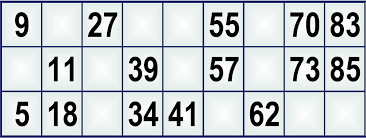

# Tombola :motor_scooter:

* Scrivete una funzione che prende in input una cartella della tombola sotto forma di matrice 3*5 e un array di numeri estratti (almeno 20 numeri, non ripetuti).
* La funzione controllerà quanti ambi, terni, quaterne e cinquine sono presenti nella scheda e restituirà la stringa «il giocatore ha totalizzato ambi: numero ambi etc..
* In caso di tombola invece, la funzione restituirà direttamente la stringa «TOMBOLA!!»

