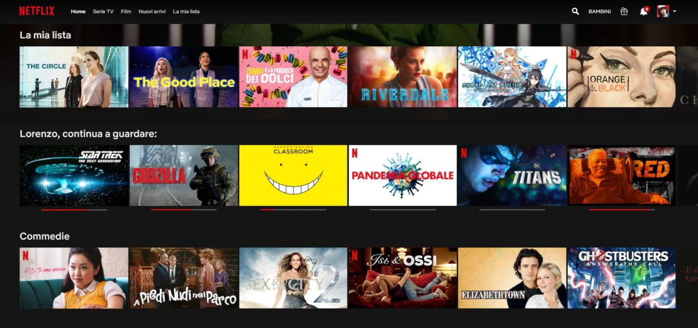

# Streaming Service

Siamo ormai abituati a usufruire sempre più spesso di servizi di streaming che ci permettono di vedere qualsiasi programma senza bisogno di cercarlo in televisione e senza dover aspettare che qualcuno decida di mandarlo in onda quando noi siamo liberi.

Tra i più famosi possiamo citare _Netflix, Prime Video o Disney Plus_.

Molti elementi che compongono questi servizi, possono essere ricondotti ad una struttura a classi tipica della programmazione ad oggetti.

## :kick_scooter: Abbonamento Basic

Sfruttando le caratteristiche della OOP, creare delle classi che simulino un servizio di streaming classico.
Prendete ispirazione da quello che conoscete meglio e sviluppate la "libreria" più adatta a contenere tutte le informazioni.

Un esempio di alcune possibili classi (da integrare ed estendere con le informazioni mancanti):
+ _Profilo_
  + Email
  + Password
  + Tipo di Offerta
  + Utenti
+ _Utente_
  + Nome
  + Avatar
  + Tipo Utente (normale/kid)
  + Pin
+ _Prodotto in Catalogo_
  + Titolo
  + Anno
  + Cast
  + Genere
  + PG
  + Originale
+ _Film_
+ _Serie TV_
  + Numero Stagioni
  + Numero Episodi per Stagione
+ _Documentario_

_**ATTENZIONE!** Una delle classi dell'esempio è astratta. Alcuni degli attributi indicati potrebbero essere ricondotti ad ulteriori classi invece che a tipi più semplici. Sfruttare anche gli enum dove possibile/sensato._

## :motor_scooter: Abbonamento Standard

+ Aggiungere la funzionalità "La mia lista" che permette all'utente di memorizzare una lista personalizzata di prodotti da guardare;
+ Aggiungere lapossiblità ad un Utente di indicare se un prodotto gli piace o meno (si può anche decidere di fare una valutazione a stelle, da 1 a 5).

_**ATTENZIONE!** Valutare sempre bene in quali classi inserire le informazioni e in quale modo._

## :motorcycle: Abbonamento Premium

+ Creare un metodo che, dato un genere (es. Azione, Horror, Commedia) o una categoria (Film, Serie TV, Documentario), restituisce una lista di prodotti di quel genere o di quella categoria;
+ Creare un metodo che, dato un Utente, ritorni una lista di altri prodotti in catalogo che potrebbero interessargli basandosi sugli elementi presenti nella sua lista e sulle sue valutazioni dei prodotti;
+ Creare un metodo che, data una lista di Utenti, ritorna una lista dei 10 titoli più popolari basandosi sugli elementi presenti nelle loro liste e sulle valutazioni dei prodotti.

_**Consiglio per stilare una classifica:** se avete inserito la valutazione a stella, potete scegliere quanti punti dare ad un elemento nella lista dell'utente (p.es. 3 punti che si sommano all'eventuale valutazione 1-5) oppure, nel caso di mi piace e non mi piace, dare 1 punto per i "mi piace", -1 punto i "non mi piace" e 1 punto extra se sono presenti nella lista dell'utente._

## Nota Bene

Questo esercizio dá la possibilità di sfruttare alcuni aspetti dell'ereditarietà, che vedremo nei moduli 5 e 6, e delle generics collection, del modulo 7. Una volta sostenuti questi moduli, è possibile riprendere in mano l'esercizio per migliorare il risultato sfruttando le nuove conoscenze.
